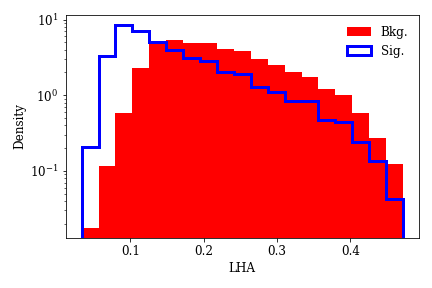
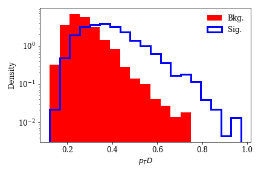
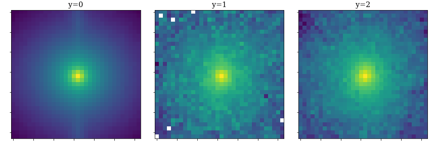
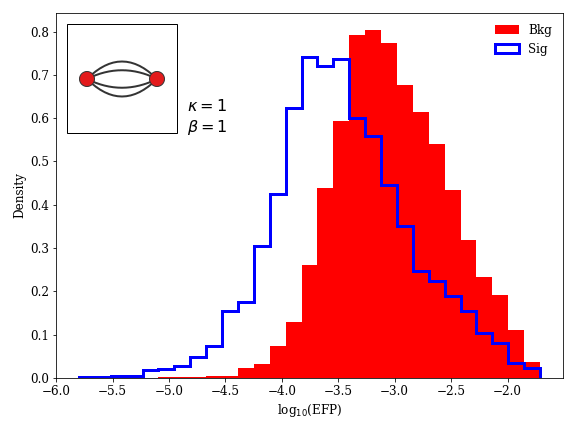

# LHCO EFN/PFN Code

## Data Format

Data should be, initially, in the form of a NxMx4 or NxMx3 array, where
- N = Number of events
- M = Number of constituents in each event
- (3 or 4) = [pT, eta, phi] or [pT, eta, phi, mass] values in each constituent

This information can be generated from raw data through an interface like [pyjet](https://github.com/scikit-hep/pyjet). A sample of the data format is also downloadable through [energyflow](https://energyflow.network/) with the function `qg_jets.load()` or by running [`data_processing/download_samples.py`](data_processing/download_samples.py)

```python
from energyflow.datasets import qg_jets

# N = Number of events
X, y = qg_jets.load(N=10000)
```

Because events won't always have an identical number of constituents, this dataset (and any used here) will need to pad shorter arrays (the M-axis from the NxMx3 or NxMx4 arrays) with zeros. A function called `pad_array` is given in [`data_processing/tools.py`](data_processing/tools.py) which will convert a list of Mx3 or Mx4 arrays into a an NxMx3 or NxMx4 array with zero padding. From this point, I will just refer to the NxMx4 and NxMx3 arrays (i.e. the data format the rest of the code uses) as "FlowNetwork" formatted data.

## Data Processing
FlowNetwork data will work, as is, with any PFN or EFN. In order to generate Jet Substructure observables, Jet Images and Energy Flow Polynomials, code is given in ```data_processing``` directory. A code runner file ```data_processing/process_pipeline.py``` is also given which will run all the data processing code in order.

### Jet Substructure Observables (JSS)
Code given in [`data_processing/generate_HL.py`](data_processing/generate_HL.py) uses the FlowNetwork data and reads python files in from `data_processing/JSS` to calculate a JSS. To include a new JSS observable, simply add a new python file into the `JSS` directory. Each file will need to read in the FlowNetwork data and output a 1 dimensional array. A template file is given in [`data_processing/JSS/jss_template.py`](data_processing/JSS/jss_template.py). These can be visualized using the jupyter notebook in [`vis_data/plot_HL.ipynb`](vis_data/plot_HL.ipynb) and some examples are given below




### Jet Images
Jet images are calculated in [`data_processing/generate_jet_images.py`](data_processing/generate_jet_images.py) using the energyflow package's [`pixelate`](https://energyflow.network/docs/utils/#pixelate) function. These can be visualized using the jupyter notebook in [`vis_data/plot_jet_images.ipynb`](vis_data/plot_jet_images.ipynb) 




### Energy Flow Polynomials (EFP)
Energy Flow Polynomials are calculated in [`data_processing/generate_EFPs.py`](data_processing/generate_EFPs.py). EFPs are stored in a group (labelled `efp`) and targets in a dataset labelled `targets`. These can be accessed with [h5py](https://github.com/h5py/h5py) with the code below

```python
import h5py
f = h5py.File("EFP.h5", "r")
efps = f["efp"].keys()
y = f["targets"][:]
for efp in efps:
  efp_val = f["efp"][efp][:]
```

These can be visualized using the jupyter notebook in [`vis_data/plot_EFPs.ipynb`](vis_data/plot_EFPs.ipynb) 


